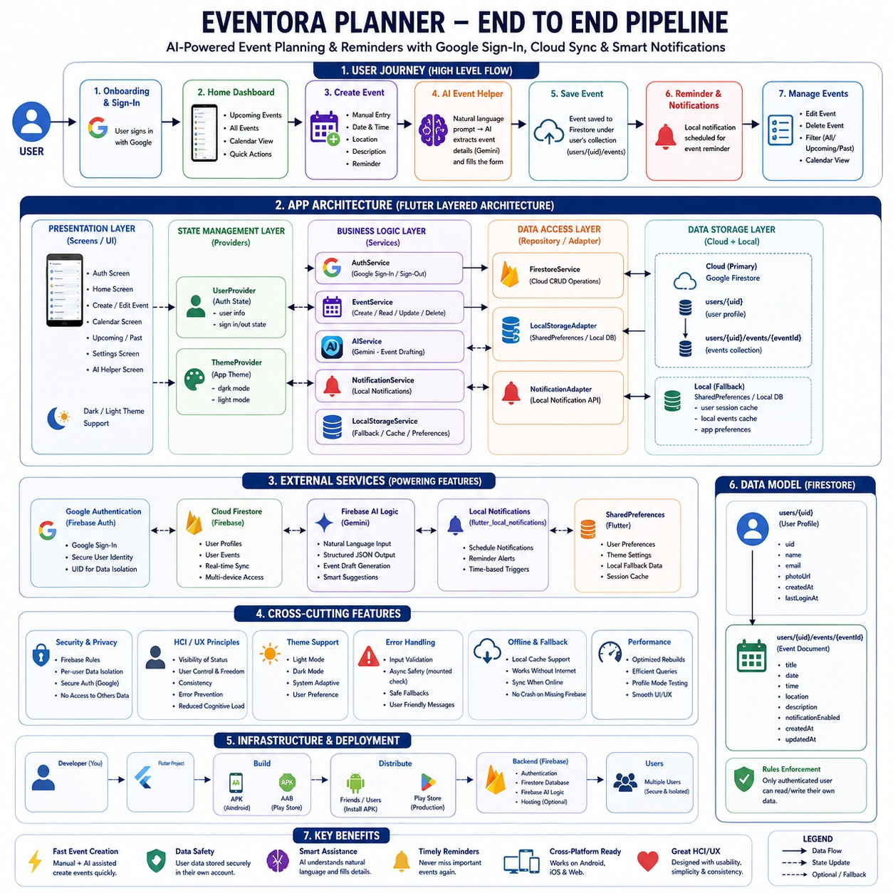

# Eventora Planner

Eventora Planner is a Flutter HCI project for event planning and reminders with:

- Google sign-in
- per-user Firestore event storage
- AI-assisted event creation (Firebase AI Logic / Gemini)
- local notification reminders
- dark/light theme


### App Workflow & UI


This README is the single clean source of truth for your project.

## 1) Project Goal

Build an event app that is easy to use, visually consistent, and safe for multiple users on shared devices.

## 2) Core Features

- Create, edit, and delete events
- Event listing: All / Upcoming / Past
- Calendar view with event markers
- Notification scheduling
- Google sign-in
- Per-user cloud data (`users/{uid}/events/{eventId}`)
- AI event drafting from natural language
- Dark mode support

## 3) HCI / UX Rationale (Why this design)

- **Visibility of status**: snackbars + loading states for async actions
- **Error prevention**: date/time validation + mounted checks after async calls
- **Consistency**: reusable UI patterns + provider-based state
- **Reduced cognitive load**: tabs, calendar markers, AI prompt-to-form filling
- **User control**: sign-out, edit/delete actions, manual fallback when AI fails

## 4) Architecture

- `lib/screens/` -> UI and interactions
- `lib/services/` -> business logic (auth, storage, AI, notifications)
- `lib/providers/` -> app state (`UserProvider`, `ThemeProvider`)
- `lib/models/` -> entities (`Event`, `AppUser`)

Data flow:

1. user action in screen
2. service call executes
3. provider state updates
4. UI rebuilds reactively

## 5) Storage Model

### 5.1 Firestore (primary for signed-in users)

- `users/{uid}` -> profile data
- `users/{uid}/events/{eventId}` -> event data

Benefits:

- data survives app cache clear / reinstall
- user A and user B data stays isolated

### 5.2 Local fallback

If Firebase is not available/configured on a platform, app safely falls back to local storage logic so app does not crash.

## 6) Firebase Setup

Required services:

- Authentication (Google)
- Firestore Database
- Firebase AI Logic (Gemini)

Android setup:

1. register package `com.example.eventora_planner`
2. add SHA-1 and SHA-256
3. place `google-services.json` in `android/app/google-services.json`

Deploy Firestore rules:

```bash
firebase use eventora-planner
firebase deploy --only firestore:rules --project eventora-planner
```

## 7) Firestore Rules

Use per-user rules (already configured in this repo):

```txt
users/{userId}             -> request.auth.uid must equal userId
users/{userId}/events/{id} -> request.auth.uid must equal userId
```

## 8) Run Commands

From project root:

```bash
flutter clean
flutter pub get
flutter run -d <device-id>
```

Performance check:

```bash
flutter run -d <device-id> --profile
```

## 9) Build / Share

Release APK (share with friends):

```bash
flutter build apk --release
```

Output:

- `build/app/outputs/flutter-apk/app-release.apk`

Play Store AAB:

```bash
flutter build appbundle --release
```

Output:

- `build/app/outputs/bundle/release/app-release.aab`

## 10) iOS / Web Notes

The app is written to be Firebase-safe cross-platform:

- if Firebase is configured on iOS/Web, cloud features work
- if Firebase config is missing, app avoids hard crash with fallback behavior

iOS:

- add `GoogleService-Info.plist` in `ios/Runner`

Web:

- add Firebase web app and FlutterFire web config

## 11) Instructor Demo Flow

1. Google login with account A
2. Create event manually
3. Create event using AI prompt
4. Sign out -> login with account B
5. Show account isolation (A events not visible in B)
6. Show Firestore collections (`users`, `users/{uid}/events`)

## 12) Known Dev Notes

- Debug mode on some MIUI devices can show frame-skip/perf logs; profile/release is smoother.
- App Check warnings in dev mode are expected until full App Check setup is enforced.

## 13) Suggested Repo Name

Best repo name:

- `eventora-planner`

## 14) License

Educational project use unless you add a custom license file.

# Eventora Planner

Eventora Planner is a Flutter HCI project focused on practical usability:

- fast event creation
- clear event visibility (all/upcoming/past/calendar)
- reminder notifications
- Google sign-in
- per-user cloud data isolation
- AI-assisted event drafting

This README explains not only **how to run** the app, but also **why** design and architecture choices were made (HCI + UX reasoning).

## 1) Project Goal

Build an event planner that is:

- easy for first-time users
- consistent in light and dark mode
- safe for multi-user usage
- robust across Android + optional iOS/Web setups
- explainable in an HCI viva/demo

## 2) What Problem It Solves

Common reminder apps fail in three ways:

- too many taps to create an event
- users lose data when switching accounts/devices
- UI becomes confusing under theme or state changes

Eventora Planner addresses these with:

- simple event forms
- AI prompt-to-form generation
- user-scoped cloud storage
- clear sign-in / sign-out flow

## 3) Core Features

- Create, edit, delete events
- List filtering: All / Upcoming / Past
- Calendar view with event markers
- Notification scheduling
- Dark mode
- Google sign-in
- Firestore-backed user + event data
- AI event draft generation (Gemini via Firebase AI Logic)

## 4) HCI / UX Principles Used

### 4.1 Visibility of System Status

- Snackbar feedback on important actions (create/update/clear/sign-in errors)
- Loading indicators for async operations (Google sign-in, AI generation)

### 4.2 User Control and Freedom

- Edit/delete controls on event cards
- Sign-out always available in Settings
- AI is assistive, not forced (manual form remains primary fallback)

### 4.3 Consistency and Standards

- Reusable card/button styles
- predictable route names and navigation
- dark/light theming through a single provider

### 4.4 Error Prevention and Recovery

- date/time validation prevents past scheduling
- async-mounted checks prevent UI crashes after await
- Firebase bootstrap fallback prevents hard crash when platform config is missing

### 4.5 Recognition Rather Than Recall

- tabbed lists + calendar markers reduce memory load
- AI converts natural language into prefilled fields to reduce typing effort

## 5) Architecture (How It Works)

The app follows a simple layered Flutter architecture:

- `screens/` UI and user interaction
- `services/` business logic and external integrations
- `providers/` app/user/theme state
- `models/` event and user entities

### 5.1 State Management

- `Provider` is used for:
  - user state
  - theme state

### 5.2 Data Flow

- UI triggers service methods
- service reads/writes local/cloud data
- provider updates state
- UI rebuilds reactively

## 6) Data Storage Design

### 6.1 Why Cloud + Local Hybrid

We use Firestore for logged-in users so data persists after cache clear/reinstall.
We keep local fallback for scenarios where Firebase is unavailable or user is local/offline.

### 6.2 Firestore Structure

- `users/{uid}`
  - `uid`, `name`, `email`, `photoUrl`, `createdAt`, `lastLoginAt`
- `users/{uid}/events/{eventId}`
  - event fields (`title`, `date`, `time`, `location`, `description`, `notificationEnabled`, ...)

### 6.3 Multi-User Isolation

Events are scoped by Firebase UID:

- account A cannot read account B events
- sign out/in switches to correct user dataset

## 7) Authentication Design

Google sign-in flow:

1. user taps "Continue with Google"
2. Firebase Auth returns user
3. user profile upserted in Firestore
4. local session flags updated
5. app navigates to home

Sign-out flow:

1. local session cleared
2. Firebase + Google sign-out called
3. user provider reset
4. auth screen reopened

## 8) AI Integration Design

AI uses Firebase AI Logic (`firebase_ai`) for structured event draft generation.

Why this approach:

- avoids deprecated direct SDK usage
- aligns with Firebase ecosystem
- easier future production hardening (App Check, Remote Config model control)

AI behavior:

- takes natural language input
- attempts strict JSON extraction
- validates date/time format
- rejects invalid or past date drafts
- falls back with user-friendly errors

## 9) Cross-Platform Compatibility Strategy

The app includes safe Firebase bootstrap logic:

- if Firebase config exists on platform => cloud features enabled
- if missing => app remains usable with local fallback

This prevents hard startup crashes on partially configured targets (iOS/Web during setup).

## 10) Security

### 10.1 Firestore Rules

Rules are user-scoped:

- only authenticated user can read/write their own profile/events

### 10.2 App Check

Recommended for production (Android: Play Integrity).
During development, warnings may appear if App Check provider is not yet installed.

## 11) Setup Guide

## 11.1 Prerequisites

- Flutter SDK installed
- Android Studio / VS Code Flutter tooling
- Firebase project configured

## 11.2 Firebase Required Setup

1. Create/select Firebase project (recommended: `eventora-planner`)
2. Register Android app:
  - package: `com.example.eventora_planner`
3. Add SHA-1 and SHA-256 fingerprints
4. Download and place:
  - `android/app/google-services.json`
5. Enable in Firebase:
  - Authentication > Google
  - Firestore Database
  - Firebase AI Logic
6. Deploy Firestore rules:

```bash
firebase use eventora-planner
firebase deploy --only firestore:rules --project eventora-planner
```

## 11.3 Run Commands

From project root:

```bash
flutter clean
flutter pub get
flutter run -d <device-id>
```

Performance test:

```bash
flutter run -d <device-id> --profile
```

## 12) Build and Distribution

### 12.1 Share with Friends (APK)

```bash
flutter build apk --release
```

Output:

- `build/app/outputs/flutter-apk/app-release.apk`

### 12.2 Play Store (AAB)

```bash
flutter build appbundle --release
```

Output:

- `build/app/outputs/bundle/release/app-release.aab`

Upload this AAB in Play Console release flow.

## 13) Demo Script (for Instructor)

1. Show login with Google
2. Create one event manually
3. Create one event with AI prompt
4. Switch to dark mode and verify readability
5. Sign out and sign in with another account
6. Show account data isolation
7. Open Firebase Console and show:
  - users collection
  - per-user events subcollection
8. Explain HCI rationale (status feedback, consistency, error prevention, reduced cognitive load)

## 14) Known Development Notes

- First debug launch on MIUI/Redmi may show frame-skip/perf logs.
- Prefer profile/release mode when evaluating perceived performance.
- Some Google Play services warnings on custom ROMs are non-blocking.

## 15) Suggested Repository Name

Recommended repo name:

- `eventora-planner`

Alternative names:

- `eventora-hci-project`
- `eventora-ai-reminder`

## 16) License

Educational use by default unless you add a formal license file.

# Eventora Planner

Eventora Planner is a Flutter-based event reminder app with:

- local + cloud-backed event management
- Google login using Firebase Authentication
- per-user event storage in Firestore
- AI-assisted event draft generation using Firebase AI Logic (Gemini)

This project was prepared as an HCI course project and focuses on practical usability.

## Key Features

- Create, edit, and delete events
- Calendar and upcoming/past event views
- Local notifications for event reminders
- Dark mode support
- Google sign-in support
- User-isolated data (account A cannot see account B events)
- AI event generation from natural language prompt

## Tech Stack

- Flutter / Dart
- Provider (state management)
- SharedPreferences (local preferences)
- Firebase Authentication (Google login)
- Cloud Firestore (user profile + user events)
- Firebase AI Logic (Gemini)
- flutter_local_notifications

## Project Identity

- App display name: `Eventora Planner`
- Android package: `com.example.eventora_planner`
- Firebase project: `eventora-planner`

## Folder Highlights

- `lib/screens/` UI screens
- `lib/services/` app services (auth, storage, notifications, AI)
- `lib/providers/` state providers
- `android/app/google-services.json` Firebase Android config
- `firestore.rules` Firestore security rules

## Setup (Android)

1. Install Flutter SDK and Android toolchain.
2. Clone project.
3. Add Firebase Android app with package:
  - `com.example.eventora_planner`
4. Download `google-services.json` and place in:
  - `android/app/google-services.json`
5. Add SHA-1/SHA-256 in Firebase (Project Settings > Your apps).
6. Enable in Firebase:
  - Authentication > Google
  - Firestore Database
  - Firebase AI Logic (Gemini)

Then run:

```bash
flutter clean
flutter pub get
flutter run -d <device-id>
```

## iOS / Web Compatibility Notes

The app now uses safe Firebase bootstrap logic:

- If Firebase is configured on a platform, cloud features are used.
- If Firebase is missing on a platform, app falls back safely instead of hard crashing.

For iOS:

- Add Firebase iOS app
- Place `GoogleService-Info.plist` in `ios/Runner`

For Web:

- Add Firebase Web app and configure FlutterFire web options

## Firestore Data Model

- `users/{uid}`
  - `uid`
  - `name`
  - `email`
  - `photoUrl`
  - `createdAt`
  - `lastLoginAt`
- `users/{uid}/events/{eventId}`
  - event fields (`title`, `date`, `time`, `location`, etc.)

## Security Rules

Current rules restrict access to owner user:

```txt
users/{userId}               -> only auth userId
users/{userId}/events/{id}   -> only auth userId
```

Deploy rules:

```bash
firebase deploy --only firestore:rules --project eventora-planner
```

## AI Event Generation

In Create Event screen:

1. Enter natural text in "Describe with AI"
2. Tap "Generate Event with Gemini"
3. Review generated fields
4. Save event

Example prompt:

- `Meeting with supervisor tomorrow at 5 PM in Lab 2`

## Multi-Account Behavior

Events are now user-scoped in Firestore and separated by UID.

- Signing in with account B does not show account A events.
- Re-login reloads that account's own events.

## Build and Share

### Debug run

```bash
flutter run -d <device-id>
```

### Profile run (better performance check)

```bash
flutter run -d <device-id> --profile
```

### Release APK (share directly with friend)

```bash
flutter build apk --release
```

Output:

- `build/app/outputs/flutter-apk/app-release.apk`

### Play Store AAB

```bash
flutter build appbundle --release
```

Output:

- `build/app/outputs/bundle/release/app-release.aab`

## Recommended Demo Flow (for Instructor)

1. Login with Google account A
2. Create event manually
3. Create event with AI prompt
4. Sign out, login with account B
5. Show account isolation (A events not visible)
6. Open Firebase Console and show:
  - users collection
  - events subcollection per user

## Known Notes

- First debug launch can show frame-skip logs on MIUI devices; profile/release is smoother.
- App Check is recommended before production release.


Got you — here’s a clean **.md file content**. Just copy-paste directly into your `README.md` 👇

---

```md
# 📱 iOS + Web + Device Command Guide

This guide explains how to run your Flutter app on **Android, Web, and iOS**, select a specific device, and configure Firebase properly.

---

## 🔍 1. List Available Devices

First, check all connected devices:

```bash
flutter devices

```

You will see device IDs like:

- 📱 Android phone → `d42966c9` (example)
- 🌐 Chrome (Web) → `chrome`
- 🍎 iOS simulator/device → Only visible on macOS with Xcode

---

## ▶️ 2. Run on a Specific Device

Use this command:

```bash
flutter run -d <device-id>

```

### Examples:

```bash
flutter run -d d42966c9
flutter run -d chrome

```

💡 If multiple Android devices are connected, always use the correct device ID from `flutter devices`.

---

## 🤖 3. Android Run Commands

From your project root:

```bash
flutter clean
flutter pub get
flutter run -d d42966c9

```

### ⚡ Profile Mode (Performance Testing)

```bash
flutter run -d d42966c9 --profile

```

### 📦 Build Release APK

```bash
flutter build apk --release

```

### 📦 Split APKs (Smaller Size)

```bash
flutter build apk --release --split-per-abi

```

---

## 🌐 4. Web Run Commands

### Enable Web (One-Time Setup)

```bash
flutter config --enable-web

```

### Run on Web

```bash
flutter run -d chrome

```

### Build for Production

```bash
flutter build web

```

📁 Output Folder:

```
build/web/

```

---

### ⚠️ Web Firebase Note

If you see this error:

```
FirebaseOptions cannot be null when creating the default app

```

👉 This means Firebase Web config is missing.

- App will still run (safe fallback)
- But features like:
  - Google Sign-In
  - Firestore
  - AI (Gemini)

❌ Will NOT work until Firebase is configured

---

## 🍎 5. iOS Support (Important)

### 🚫 Reality Check

iOS build requires:

- macOS
- Xcode
- CocoaPods

👉 You **cannot run iOS on Linux/Windows**

---

### 🔥 iOS Firebase Setup

1. Open Firebase Console
2. Add an iOS app (use your bundle ID)
3. Download `GoogleService-Info.plist`
4. Place it here:

```
ios/Runner/GoogleService-Info.plist

```

1. Open in Xcode:

```
ios/Runner.xcworkspace

```

1. Ensure the file is added to the **Runner target**

---

### ▶️ Run iOS (macOS only)

```bash
flutter clean
flutter pub get
cd ios && pod install && cd ..
flutter run -d ios

```

### Run on Specific iOS Device

```bash
flutter devices
flutter run -d <ios-device-id>

```

### 📦 Build iOS Release

```bash
flutter build ipa

```

---

## 🔥 6. Firebase Setup Checklist (All Platforms)

Make sure these are enabled in Firebase:

- ✅ Authentication → Google
- ✅ Firestore Database
- ✅ Firebase AI Logic (Gemini)

---

### 📁 Required Files

**Android**

```
android/app/google-services.json

```

**iOS**

```
ios/Runner/GoogleService-Info.plist

```

**Web**

- Web app registered in Firebase
- Config added in:

```
lib/firebase_options.dart

```

---

### 🚀 Deploy Firestore Rules

```bash
firebase use eventora-planner
firebase deploy --only firestore:rules --project eventora-planner

```

---

## 🧠 7. What Works Without Full Firebase Setup

Your app uses a **safe Firebase fallback**, so:

- ✅ UI will still run
- ❌ Cloud features will be disabled

### Disabled Features:

- Authentication
- Firestore
- AI features

👉 This prevents crashes during demos 👍

---

## ✅ Summary

- Use `flutter devices` to find device IDs
- Run apps using `flutter run -d <device-id>`
- Android & Web work on any system
- iOS requires macOS + Xcode
- Firebase must be configured per platform for full functionality

---

```

---

If you want, I can next:
- Turn this into a **GitHub-level pro README (badges + screenshots + sections)**
- Or make a **step-by-step setup guide with images (super easy for revision)**

```

## License

Use for educational purposes unless you add your own license policy.
